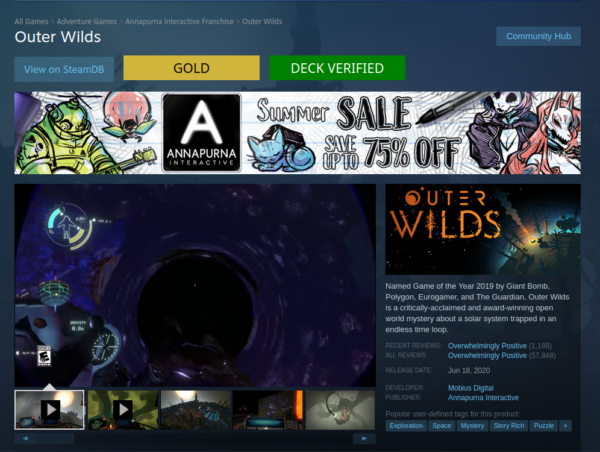

# Mark's Steam Script V2 By Treyson

a script that enhances Steam Store pages by displaying Proton compatibility status and Steam Deck compatibility. The script also provides links to the game's ProtonDB and SteamDB pages for more details

**Note**: this only works in web browsers, not the official Steam client.

## I wouldve forked this but his repo includes more than just this script
[Original repo](https://github.com/mkwsnyder/marks-user-scripts/tree/master/scripts/marks-steam-script) | [Original Creator](https://github.com/mkwsnyder)

Thanks mark its cool i want steamdeck specific info

## How to Install

This requires the [Tampermonkey](https://www.tampermonkey.net/) extension or some equivalent.

- [Firefox](https://addons.mozilla.org/en-US/firefox/addon/tampermonkey/)
- [Chrome](https://chrome.google.com/webstore/detail/tampermonkey/dhdgffkkebhmkfjojejmpbldmpobfkfo)

### Manual Install

1. Install Tampermonkey
2. Go to the Tampermonkey Dashboard (this can be accessed by clicking on the Tampermonkey icon in your toolbar and selecting "Dashboard" from the dropdown)
3. Go to the "Utilities" tab on the right
4. Copy [this link](https://raw.githubusercontent.com/mkwsnyder/marks-user-scripts/main/scripts/marks-steam-script/script.js) and paste it into the "Install from URL" option, then click "Install".
5. Click "Install" on the next screen

## Notes

When you first view a page where it will run (a page for a game) it will ask you if it can make a web request. This is simply getting a JSON file from [ProtonDB](https://www.protondb.com/) for the Linux compatibility. Always allowing it will make it run without issue.