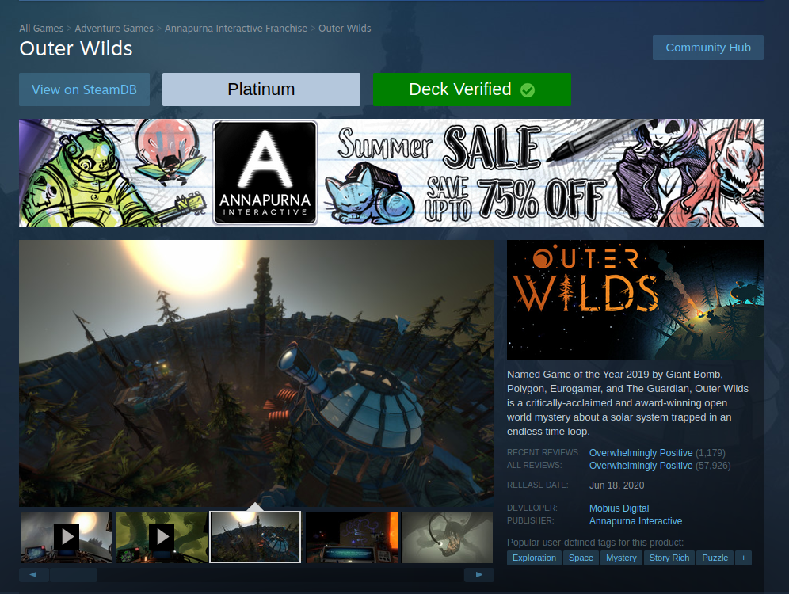

# Steam Deck Proton Status Script

a script that enhances Steam Store pages by displaying Proton compatibility status and Steam Deck compatibility. The script also provides links to the game's ProtonDB and SteamDB pages for more details

**Note**: this only works in web browsers, not the official Steam client.

## I wouldve forked this but his repo includes more than just this script

[Original repo](https://github.com/mkwsnyder/marks-user-scripts/tree/master/scripts/marks-steam-script) | [Original Creator](https://github.com/mkwsnyder)

Thanks mark its cool, I want steamdeck specific info :/

## Notes

When you first view a page where it will run (a page for a game) it will ask you if it can make a web request. This is simply getting a JSON file from [ProtonDB](https://www.protondb.com/) for the Linux compatibility. Always allowing it will make it run without issue.
